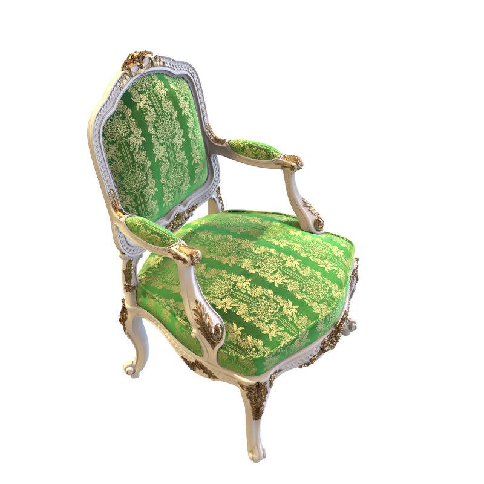
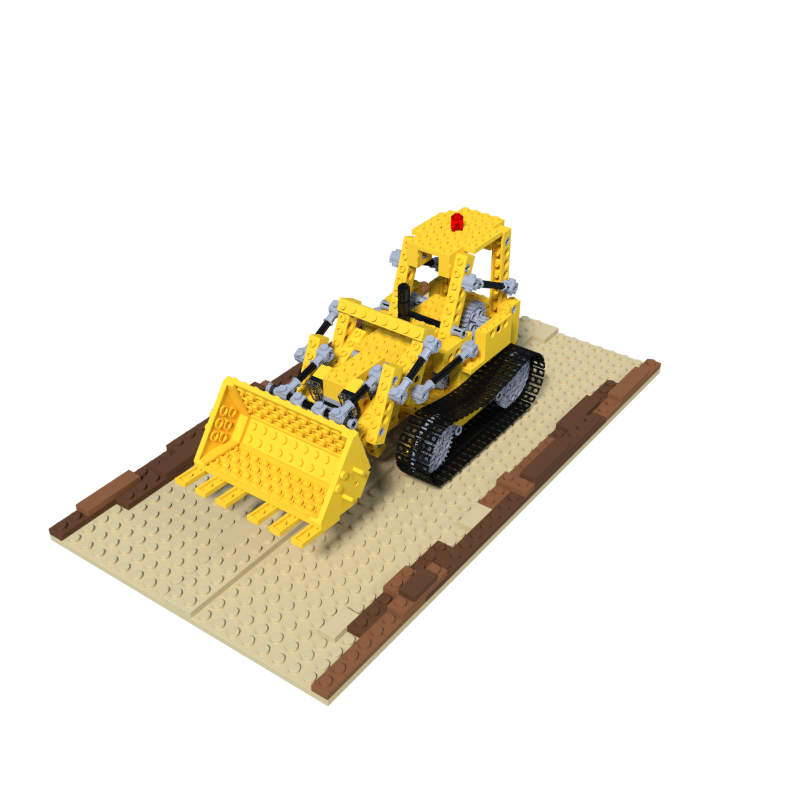
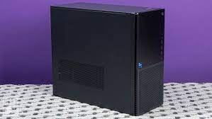

#  FAFO

Fetch Anything From Objaverse

## Introduction

FAFO (Fetch Anything From Objaverse) is a tool that enables you to convert 3D models from glTF format to OBJ format easily and efficiently.

## Setup:

Ensure that you have Blender installed on your system and NumPy installed for Python-in-Blender.

For example, on Ubuntu 22.04, you can use the following commands to install Blender and NumPy:

```bash
sudo apt install blender
sudo apt-get install python3-numpy
```

Blender typically uses `/usr/bin/python3.10`, but you can use the `sys.executable` command inside Blender Python Terminal to check the Python path.

Now let's set up python venv. Run:

```bash
conda create -n fafo python=3.9
conda activate fafo
pip install -r requirements.txt
```

Use this venv to run scripts provided and notebooks.

## Insight

For a light user, you can use `objaverse_xl_easy.ipynb` only. It is a very simple usage, searching based on the filename stored in the metadata from objaverse. In fact, you can already find a lot of files if you only want to find common objects like 'chair'. Download functions are given.

If you really want to search for objects using a general name, use `fetcher`.

`fetcher` helps you classify an object. It first downloads data from objeverse, then it judges if the item is in your class and decide whether to keep it. The classifying is implemented with CLIP, so it is a zero-sample classification. 

I thought about how to classify things with CLIP. Maybe I can set a threshold? But different things do not share one. Maybe I use BLIP to help? But we can no more use a general class. Then I discovered this: I can directly compare the clip score of (obj, given-class) and (obj, 'object'), that is:

<p align="center">
  
  
  
  
  
</p>

| gt\score | Chair | Dog  | Lego | Desktop | Person | Object |
| -------- | ----- | ---- | ---- | ------- | ------ | ------ |
| Chair    | 31.5  | 25.2 | 25.5 | 22.9    | 24.9   | 29.6   |
| Dog      | 20.1  | 32.8 | 23.8 | 22.2    | 25.7   | 25.6   |
| Lego     | 25.3  | 29.2 | 33.5 | 28.1    | 29.2   | 31.5   |
| Desktop  | 22.4  | 25.1 | 28.0 | 30.0    | 26.3   | 28.9   |
| Person   | 27.4  | 30.9 | 26.7 | 30.6    | 35.5   | 31.5   |

Really funny.

## Usage

Modify the `fetch.json.template` file and rename it.

Run

```bash
python fetcher.py
```

## Additional Tools:

### gltf2obj:

`gltf2obj` is a tool that converts a single glTF file to an OBJ file.

#### Running the Tool:

Once you have set up the environment, you can convert a glTF file to an OBJ file using the following command:

```bash
blender -b -P tools/gltf2obj.py -- yourfile.gltf youroutput.obj
```

### hash:

`hash` is a tool that converts filename into their sha256 value. You should set a directory and file extension.

```bash
python hash.py /path/to/directory .obj
```

#### Future Enhancements:

Maybe.